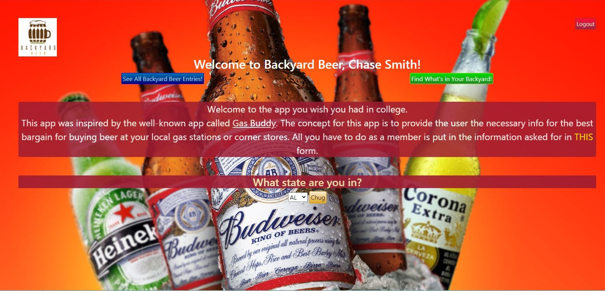

# Backyard-Beer

Backyard Beer is the web application people wish they had in college.
Working similar to the functionality of Gas-Buddy, this app allows the user to see what the best prices are at the local gas stations and corner stores.
As well, the user can input what they bought and how much it cost them. 

Full CRUD command functionality

- **Python** project in **Django** Framework
- Backend utilizes **SQLite** database
- Authentication via **Regex** and **BCrypt**
